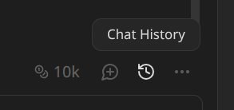

# ChatGPT to Obsidian Copilot Converter

A Python tool that converts exported ChatGPT conversations to Markdown format compatible with the [Obsidian Copilot plugin](https://github.com/logancyang/obsidian-copilot). This allows you to archive and continue your ChatGPT conversations locally in Obsidian.

## Step 1: Export Your ChatGPT Data

1. Go to [ChatGPT](https://chatgpt.com/)
2. Navigate to your account settings: **Settings** → **Data controls** → **Export data**
3. Click **Export** and confirm
   - **Note**: Archived conversations are included in the export, so consider cleaning them up first if desired

## Step 2: Convert to Obsidian Format

1. Extract the downloaded zip file to a folder (e.g., `chatgpt-data`) in the same directory as the script
2. Run the conversion with one of these commands:

   **Option A: Convert from HTML export (recommended)**
   ```bash
   python3 ChatGPT2ObsidianCopilot.py --html chatgpt-data/chat.html --output-dir chatgpt-data/converted
   ```

   **Option B: Convert from JSON files**
   ```bash
   python3 ChatGPT2ObsidianCopilot.py conversations.json --assets chatgpt-data/assets.json --output-dir chatgpt-data/converted
   ```

3. **Command options:**
   - `--html <file>` — Extract conversations from `chat.html` (includes assets automatically)
   - `conversations.json` — Path to the JSON file (use with `--assets`)
   - `--assets <file>` — Path to `assets.json` containing media references (optional, auto-extracted with `--html`)
   - `--output-dir <dir>` — Output directory for generated Markdown files
   - `--model <key>` — AI model key for the Copilot plugin (optional, defaults to `openai/gpt-oss-120b|openrouterai`)

## Step 3: Import into Obsidian

1. Copy all generated Markdown files from the `converted` folder into the `copilot-conversations` folder in your Obsidian vault
2. Copy media files (images, audio, etc.) to your Obsidian vault, preserving the original folder structure
3. Open Obsidian Copilot to access your imported chats in the chat history

   